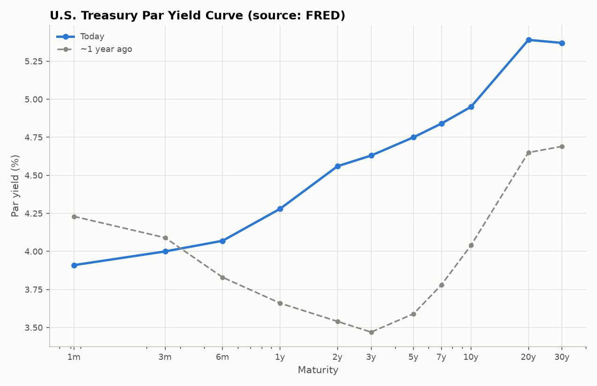
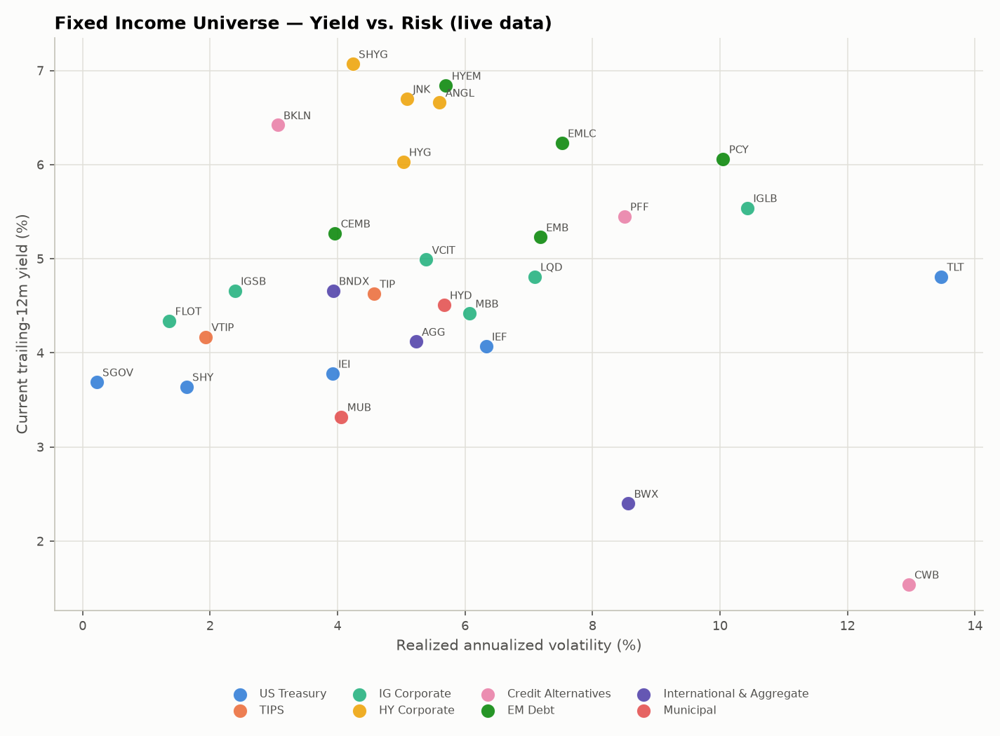
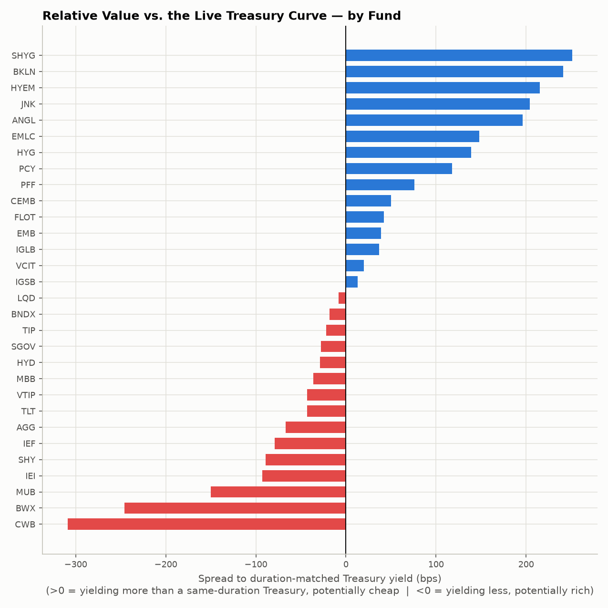
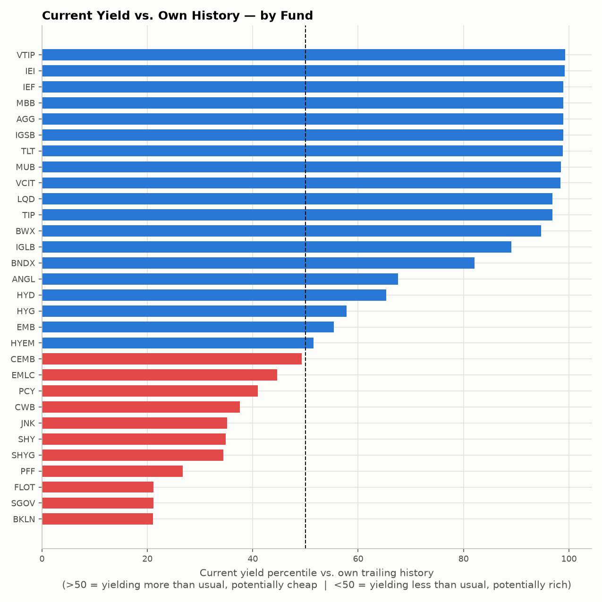

# Fixed Income Relative Value Screener

Systematic relative-value analysis across a live universe of approximately 30 exchange-traded fixed-income funds — U.S. Treasuries, TIPS, investment-grade and high-yield corporates, credit alternatives (bank loans, preferred securities, convertibles), emerging market debt, international and municipal bonds. The tool ranks the universe by risk-adjusted yield and identifies which segments are trading rich or cheap both against their own history and against the live Treasury curve today.

The analysis is fully data-driven and pulls from **two independent live sources**: no assumptions are hard-coded. Every execution retrieves current ETF prices and dividend distributions from Yahoo Finance, the live U.S. Treasury par curve from FRED, and recomputes all metrics from source.

## Methodology

1. **Data acquisition** — live price and dividend history for ~30 bond ETFs via `yfinance`, spanning ultra-short to long-duration Treasuries, TIPS, investment-grade and high-yield corporates (including fallen angels), bank loans, preferred securities, convertibles, USD- and local-currency emerging market debt (sovereign, corporate, and high yield), international government bonds, and investment-grade and high-yield municipals. Separately, the live U.S. Treasury par yield curve (1 month through 30 years) is pulled from FRED as a public CSV — a second, independent source.

2. **Derived metrics, recomputed on every run**
   - **Trailing twelve-month yield** — realized distributions over the preceding 365 days, divided by current price
   - **Realized volatility** — annualized standard deviation of daily returns
   - **Yield percentile versus own history** — the current yield's position within that fund's trailing distribution, benchmarked against itself
   - **Spread to duration-matched Treasury** — the fund's current yield minus the live Treasury curve interpolated at the fund's approximate effective duration (a published-factsheet-based bucket, not a daily figure — see limitations). This is the standard practitioner relative-value frame: rich/cheap against the actual risk-free curve today, not just against a fund's own past.

3. **Ranking** — the universe is ordered by yield per unit of volatility, a risk-adjusted compensation measure applied consistently across heterogeneous segments.

4. **Supplementary module** — a standalone discounted-cash-flow bond calculator (`src/bond_pricer.py`) values a hypothetical bond using a live long-term Treasury yield as the discount-rate proxy.

## Project structure

```
fixed-income-relative-value/
├── main.py                  # pipeline orchestration
├── requirements.txt
├── src/
│   ├── etf_universe.py      # ETF universe, segment families, duration buckets
│   ├── treasury_curve.py    # live Treasury par curve (FRED) + interpolation
│   ├── data_loader.py       # ETF data acquisition, yield and volatility computation
│   ├── analysis.py          # ranked summary + spread-to-curve construction
│   ├── viz.py                # chart generation (shared style, fixed color system)
│   └── bond_pricer.py       # standalone DCF / YTM / duration calculator
└── outputs/                  # generated charts (created at runtime)
```

## Execution

```bash
pip install -r requirements.txt
python main.py
```

Requires an active internet connection. Individual ticker failures (e.g., transient rate limiting) are handled gracefully and excluded without interrupting the run. If a data source is entirely unreachable, the pipeline falls back to a clearly labeled synthetic sample so the codebase remains reviewable end-to-end.

## Output

**U.S. Treasury par yield curve — the second live data source**



**Yield versus volatility across the universe**



**Relative value versus the live Treasury curve**



**Current yield versus own trailing history**



## Live dashboard

An interactive Streamlit dashboard (`app.py`) sits on top of the same pipeline — filterable ranking table by segment family, the Treasury curve, an interactive yield-vs-volatility scatter, the spread-to-curve and percentile charts, and a per-ticker trailing-yield drill-down.

```bash
streamlit run app.py
```

## Methodology notes and limitations

- **ETF distribution yield as a proxy for yield-to-maturity.** Trailing twelve-month distribution yield is a standard practitioner approximation, but it reflects dividends already paid rather than the fund's current portfolio yield-to-maturity, and can be distorted by special distributions or portfolio turnover. Provider-reported SEC yield or YTM would be more precise where reliably available.
- **Realized volatility as a proxy for duration risk.** Price volatility captures interest-rate and credit risk jointly, not duration in isolation. It is a practical risk measure, not a substitute for provider-published effective duration.
- **Approximate, static duration buckets.** The `approx_duration_yrs` used to compute each fund's spread to the Treasury curve is a rounded illustrative figure based on published fund factsheets at the time of writing, not a live number — a fund's actual effective duration moves with rates and portfolio composition. The spread-to-curve metric should be read as directionally informative, not to the basis point.
- **Chart color and colorblind accessibility.** The yield-vs-volatility bubble chart color-codes 8 broad segment families. Every point is also directly labeled with its ticker, so identification never depends on color alone — but with 8 categories in one scatter, a colorblind reader relying on hue alone could still confuse two of them (capping the view to 3 families or faceting into small multiples would close this gap fully; not done here to keep one readable overview chart). The percentile and spread-to-curve charts use a validated two-color diverging scheme (blue = cheap side, red = rich side) rather than an arbitrary red/green choice.
- **USD-centric universe.** The current universe is predominantly USD-denominated and US-listed. Extension to EUR-denominated instruments (Bund, OAT, BTP) is a natural next step for a euro-based mandate.
- **Historical window.** The three-year lookback used for percentile ranking is a modeling choice; a different window would shift the classification of "rich" versus "cheap".
- **Not investment advice.** This is a demonstration of relative-value methodology applied to live, multi-source data, not a portfolio recommendation.

## Tech stack

Python · pandas · numpy · yfinance · FRED (public CSV) · matplotlib · streamlit · plotly

## Author

Marco Bettuzzi
Economics and Statistics, University of Turin
[github.com/bettuzzim](https://github.com/bettuzzim)
